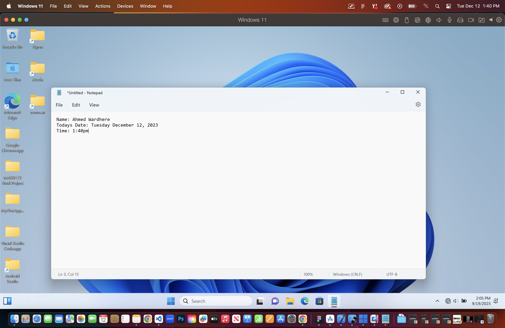

# Ahmed Wardhere MAD9112 Final Project #

*** ***
let array = [1,2,3,4,5,6]
let myArrayAverage = array.length
arrayLength = 6
let average = (array / arrayLength)

console.log(average);

for(let i = 0; i < myArrayAverage; i++)
console.log(array[i])
*** ***

